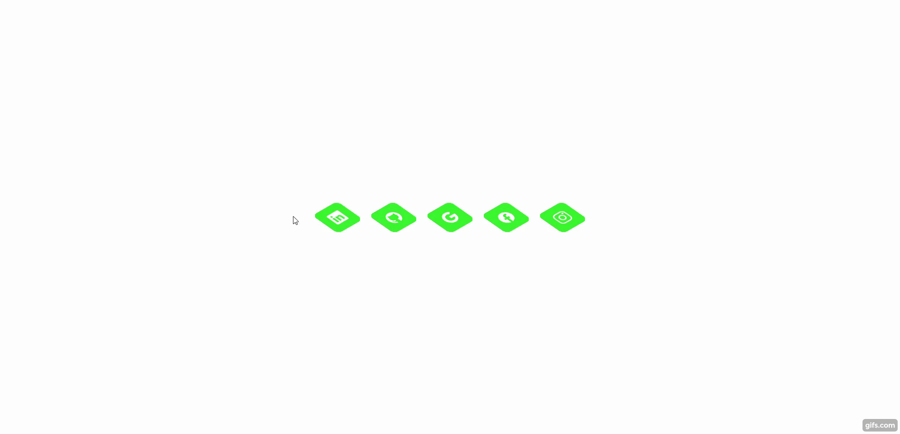

# 🚀 30diasDeCSS 🚀
 
 Fala Meu HighLander, beleza? 🖖

 30 dias de CSS3, é um desafio que aceitei de um amigo dev, o Davi-AlohaDev. Esse desafio tem como principal objetivo testar e melhorar suas habilidades realizando mini projetos diarios. 

 ## Objetivo

30 dias de CSS3 é um desafio que vou aceitar (e você também pode participar) a partir de 13 de Julho de 2023, que visa melhorar minhas habilidades em HTML5 e CSS3 através da realização de projetos.

## Regras gerais - Da autora original do desafio

* Realizar um projeto por dia
* Compartilhe seu progresso nas mídias sociais (Twitter, Facebook, Linkedin etc.) usando a hashtag #30diasDeCSS
* O projeto deve ser concluído até 23:59

Gostou da ideia? 
[Clique aqui](https://github.com/MilenaCarecho/30diasDeCSS/issues/1) para participar 

#### Youtube Referencias dos desafios
[Online Tutorials](https://www.youtube.com/channel/UCbwXnUipZsLfUckBPsC7Jog) - 
[Creative Creations](https://www.youtube.com/channel/UCOKmVksbzoKJKmtu7rlEM1A) - 
[DarkCode](https://www.youtube.com/channel/UCD3KVjbb7aq2OiOffuungzw)

* [Dia 01 - Ícone de mídia social em camadas](#id01)
* [Dia 02 - Animação de Loading](#id02)

##  Desafio dia 01 - Ícone de mídia social em camadas 

[Meu codigo](https://github.com/agneloobruno/desafio30DiasDeCSS/tree/main/dia01)

[Post LinkedIn](https://www.linkedin.com/feed/update/urn:li:activity:7085603275562975234/) 

##### O que eu aprendi

* *Criar as camadas utilizando a tag ``*
* *tranformação 2D ou 3D de um elemento [aqui](https://www.w3schools.com/cssref/css3_pr_transform.asp)*
* *[Transições CSS](https://www.w3schools.com/css/css3_transitions.asp)*
* *[Opacidade / transparência do CSS](https://www.w3schools.com/css/css_image_transparency.asp)*
* *[hover](https://www.w3schools.com/cssref/sel_hover.asp)*
* *[nth-child ()](https://www.w3schools.com/cssref/sel_nth-child.asp)*

##  Desafio dia 02 - Animação de Loading 

[Meu codigo](https://github.com/agneloobruno/desafio30DiasDeCSS/tree/main/dia02)

[Post LinkedIn]() 

##### O que eu aprendi

* *[Animations CSS](https://www.w3schools.com/css/css3_animations.asp)*
* *[@Keyframes CSS](https://www.w3schools.com/cssref/css3_pr_animation-keyframes.php)*